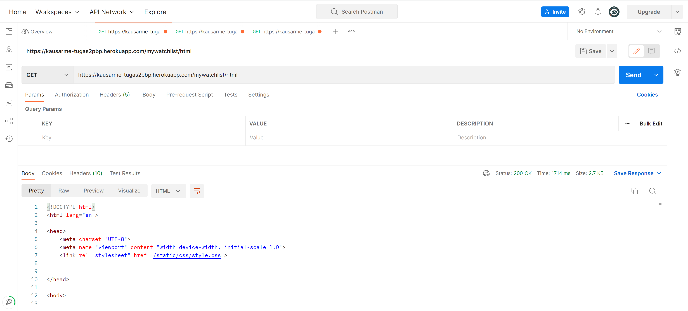
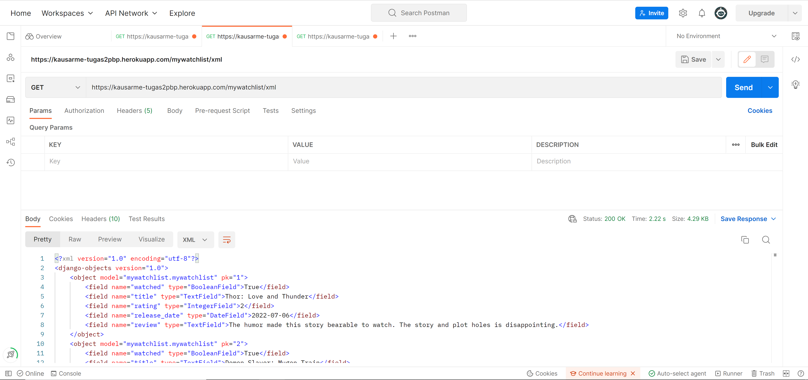
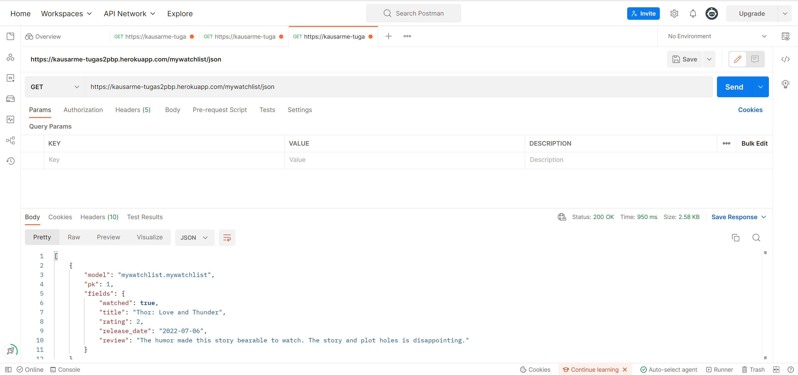

#Tugas 3:
---
    Nama: Kausar Meutuwah
    NPM: 2106630100
---

# Link Website
- HTML : [https://kausarme-tugas2pbp.herokuapp.com/mywatchlist/html](https://kausarme-tugas2pbp.herokuapp.com/mywatchlist/html)
- XML  : [https://kausarme-tugas2pbp.herokuapp.com/mywatchlist/xml](https://kausarme-tugas2pbp.herokuapp.com/mywatchlist/xml)
- JSON : [https://kausarme-tugas2pbp.herokuapp.com/mywatchlist/json](https://kausarme-tugas2pbp.herokuapp.com/mywatchlist/json)
- Heroku :[https://kausarme-tugas2pbp.herokuapp.com/mywatchlist](https://kausarme-tugas2pbp.herokuapp.com/mywatchlist/)


# JSON, XML, HTML

Secara garis besar, HTML, JSON, XML merupakan format data delivery yang sering dipakai di Django. Tetapi, XML dan JSON lebih menitikberatkan struktur dan konteks data tersebut. Sedangkan HTML menitikberatkan bagaimana format tampilan dari data tersebut muncul di halaman web.

Berdasarkan cara menyimpan elemennya, JSON lebih efisien akan tetapi tidak rapi untuk dilihat. Sedangkan XML menyimpan elemen-elemen nya dengan cara yang terstruktur, mudah dibaca oleh manusia dan mesin, akan tetapi kurang efisien. Berdasarkan penerapannya, JSON digunakan untuk mengirimkan data dengan cara data diuraikan dan dikirimkan melalui internet. Sedangkan XML memiliki data yang lebih terstruktur dan pengguna dapat menggunakannya untuk menambahkan catatan.

- XML
*Extensible Markup Language* (XML) adalah bahasa komputer yang dibuat oleh World Wide Web Consortium (W3C) untuk menyederhanakan proses pertukaran dan penyimpanan data. Pada implementasinya menggunakan format *markup* seperti HTML.

- JSON
*JavaScript Object Notation* (JSON) adalah turunan JavaScript yang digunakan dalam transfer dan penyimpanan data. Pada implementasinya banyak menggunakan kurung krawal `{}` yang berisi data berformat *key* dan *value* yang mirip dengan *dictionary* nya Python.

- HTML
*HyperText Markup Language* (HTML) adalah bahasa *markup* yang digunakan untuk menampilkan halaman website. Biasanya disandingkan dengan CSS untuk membuat halaman website.

# Data Delivery

Data delivery digunakan untuk alat komunikasi antara client dan server. Client ingin halaman web menampilkan sesuatu yang dia inginkan, digunakan Data delivery untuk mempercepat pengiriman data. Penyampaian data seringkali dalam format JSON, XML, atau format penyampaian data lainnya. 


---
# Implementasi:

## Setup: 
Sebelum mulai pull dari repo 
dan  aktifkan virutal enviroment
```bash
git pull #Untuk Mengecek apakah file sama dengan repo 
env\Scripts\activate.bat

```

## 1. Bikin Aplikasi
1. Create Aplikasi dengan menjalankan 
```bash
python manage.py startapp mywatchlist
```

2. Tambahkan nama aplikasi pada INSTALLED_APPS  di `settings.py` di `project_django`
3. Jalankan fungsi makemigrations dan migrate

## 2. Menambahkan aplikasi ke urls.py di Django
Tambahkan line berikut pada variabel urlpatterns
```python
...
path('mywatchlist/', include('mywatchlist.urls')),
...
```

## 3. Membuat Model 
- [x]  Membuat sebuah model`MyWatchList`yang memiliki atribut sebagai berikut:
    -    `watched`untuk mendeskripsikan film tersebut sudah ditonton atau belum
    -   `title`untuk mendeskripsikan judul film
    -   `rating`untuk mendeskripsikan rating film dalam rentang 1 sampai dengan 5
    -   `release_date`untuk mendeskripsikan kapan film dirilis
    -   `review`untuk mendeskripsikan_review_untuk film tersebut

```python
class MyWatchList(models.Model):  
    watched = models.BooleanField()  
    title = models.TextField()  
    rating = models.IntegerField()  
    release_date = models.DateField()  
    review = models.TextField()
```

## 4. Menambahkan minimal 10 data untuk objek`MyWatchList`yang sudah dibuat di atas
buat initial_mywatchlist_data.json
Masukkan data untuk 10 objek 
```json
{
        "model":"mywatchlist.mywatchlist",
        "pk":1,
        "fields":{
            "watched": true,
            "title": "Thor: Love and Thunder",
            "rating": 2,
            "release_date": "2022-07-06",
            "review": "The humor made this story bearable to watch. The story and plot holes is disappointing."
        }
    },
...
```

## 5. Mengimplementasikan sebuah fitur untuk menyajikan data yang telah dibuat sebelumnya dalam tiga format:
- [x] HTML
- [x] XML
- [x] JSON

Bikin views.py dan buat fungsi untuk masing masing format

```python

def show_mywatchlist(request):  
    watchlist_item = MyWatchList.objects.all()  
    context = {  
        'list_barang': watchlist_item,  
        'nama': 'Kausar Meutuwah',  
        'NPM': "2106630100",  
    }  
    return render(request, "mywatchlist.html", context)  
  
  
def show_mywatchlist_xml(request):  
    data = MyWatchList.objects.all()  
    return HttpResponse(serializers.serialize("xml", data), content_type="application/xml")  
  
  
def show_mywatchlist_json(request):  
    data = MyWatchList.objects.all()  
    return HttpResponse(serializers.serialize("json", data), content_type="application/json")  
  
  
def show_mywatchlist_xml_by_id(request, id):  
    data = MyWatchList.objects.filter(pk=id)  
    return HttpResponse(serializers.serialize("xml", data), content_type="application/xml")  
  
  
def show_mywatchlist_json_by_id(request, id):  
    data = MyWatchList.objects.filter(pk=id)  
    return HttpResponse(serializers.serialize("json", data), content_type="application/json")
```

Membuat `mywatchlist.html` pada `mywatchlist/templates` sebagai bentuk template untuk html


## 6. Membuat_routing_sehingga data di atas dapat diakses melalui URL:
-   http://localhost:8000/mywatchlist/html untuk mengakses`mywatchlist`dalam format HTML
-   http://localhost:8000/mywatchlist/xml untuk mengakses`mywatchlist`dalam format XML
-   http://localhost:8000/mywatchlist/json untuk mengakses`mywatchlist`dalam format JSON

dengan cara menambahkan baris baris berikut ke urls.py
```python
    path('', show_mywatchlist, name='mywatchlist'),  
    path('html/', show_mywatchlist, name='mywatchlist'),  
    path('xml/', show_mywatchlist_xml, name='show_mywatchlist_xml'),  
    path('json/', show_mywatchlist_json, name='show_mywatchlist_json'),  
    path('xml/<int:id>', show_mywatchlist_xml_by_id, name='show_mywatchlist_xml_by_id'),  
    path('json/<int:id>', show_mywatchlist_json_by_id, name='show_mywatchlist_json_by_id'),  
```

## 7. Mendeploy ke Heroku
Karena sudah ada Procfile dan github/worflow/dpl.yml dari tugas sebelumnya,
kita cukup menambahkan baris berikut di `procfile.sh` untuk meload data json ke models.
```
python manage.py loaddata initial_mywatchlist_data.json
```
Push ke Github, dan deployment pada herokuapp akan berjalan secara otomatis.
## 8. Membuat Readme
Ini adalah Readmenya.

## 9. Mengakses tiga URL di poin 6 menggunakan Postman, menangkap screenshot, dan menambahkannya ke dalam README.md
- Gunakan Postman untuk memeriksa respons aplikasi dari luar.

## 10. Menambahkan unit test pada tests.py untuk menguji bahwa tiga URL di poin 6 dapat mengembalikan respon HTTP 200 OK
- import Client dan TestCase
```python
from django.test import TestCase, Client
```
- Buat fungsi untuk mengecek URL - URL ada dan url menggunakan template yang benar
```python
    def test_exists(self):
        response = Client().get('/mywatchlist/')
        self.assertEqual(response.status_code, 200)

    def test_template(self):
        response = Client().get('/mywatchlist/')
        self.assertTemplateUsed(response, 'watchlist.html')
```

--- 

# PostMan
## HTML

## XML


## JSON



